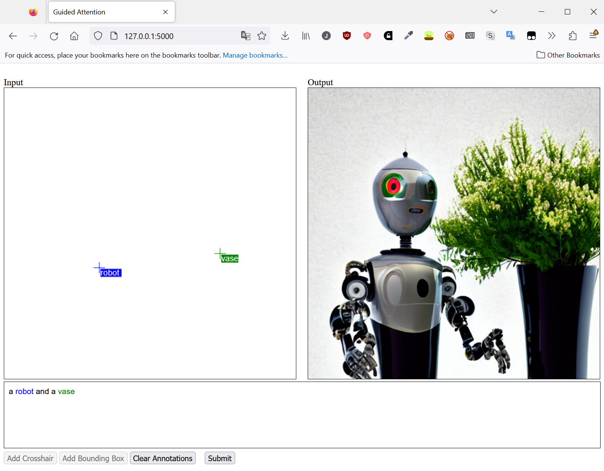

[](http://colab.research.google.com/github/jackBonadies/Guided-Attention/blob/main/notebooks/GuidedAttention.ipynb)
# Guided-Attention
Diffusion Model that allows for annotations (bounding boxes, crosshairs, keywords) to guide latent based on cross attention layers.
This model does not use any fine tuning (all modification is done at inference) and is fully compatible with existing models such as Stable Diffusion.

# Example


Demo:

https://github.com/jackBonadies/Guided-Attention/assets/13188205/3cc76da6-a2a8-4628-8428-d499d4bf5437

# Setup
This code was tested using Python 3.10, torch 1.13.1.

[Install Pytorch](https://pytorch.org/get-started/locally/) then,
```
git clone https://github.com/jackBonadies/Guided-Attention.git
cd Guided-Attention/
pip install -r environment/requirements.txt
```

To generate an image one can use:
```
python run.py --meta_prompt "a [robot:.6,.3,.4,.55] and a [blue vase:.2,.3,.4,.55]" --seeds [28] --half_precision True
```

To launch the web based gui one can use:
```
python run.py --interactive True --half_precision True
```

Note: Half precision is not mandatory, but it is recommended for most users.  Guided Attention keeps track of gradients of UNet and therefore, even with float16, takes around 9.5GB vram.

# Acknowledgements
This work builds on code from [Attend and Excite](https://github.com/AttendAndExcite/Attend-and-Excite) and [Prompt to Prompt](https://github.com/google/prompt-to-prompt)
